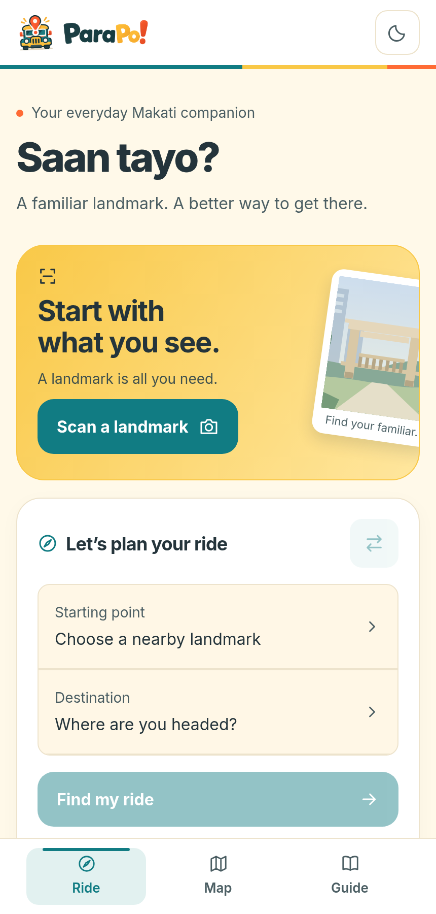
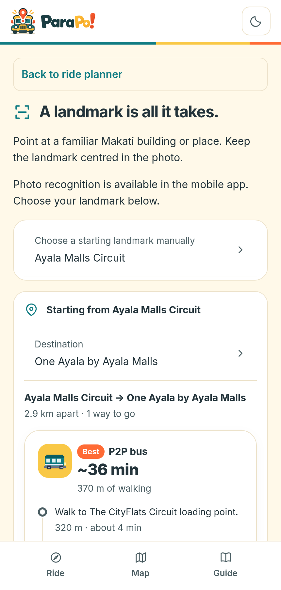
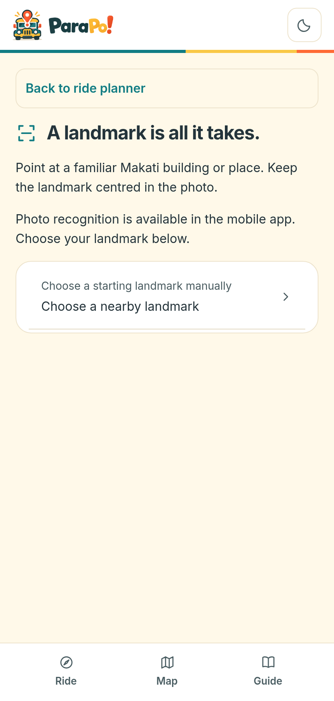

# ParaPo!

**Know the landmark, find the ride.**

ParaPo! is an offline mobile app that gets commuters around Makati. Point your camera at a landmark, or pick one from a list, then choose where you want to go. ParaPo! shows the ride: walk, jeepney, bus, P2P, or a trip with one transfer, with boarding and alighting points, walking distances, and estimated times.

> **Pilot release:** 14 Makati landmarks, from Ayala Center to Salcedo Weekend Market. The recognition model and all route data are bundled with the app, so the core flow works without a network connection.

<p align="center">
  
  
  
</p>

## Why it matters

A landmark is often easier to name than a street address, but knowing the landmark doesn't tell you which jeepney, bus or P2P to take. Most ride apps need a typed address and a connection. ParaPo! starts from what people can see:

- **Start from what's in front of you.** Recognise the landmark with the camera, or tap it. Starting from a landmark is how people already give directions.
- **Works offline.** The model runs on the phone, and every journey between the 14 landmarks is bundled with the app.
- **Honest about gaps.** Missing fares, schedules or boarding details are shown as missing. ParaPo! never guesses them.
- **Optional everything.** GPS, the camera and the map are never required. Manual selection always works.

## Highlights

- **On-device landmark recognition.** A MobileNetV3-Large model, transfer-learned and exported to TensorFlow Lite, identifies the landmark in a photo. It rejects blank, too-dark, too-bright and featureless photos before it guesses, and it always asks the user to confirm.
- **Complete journey planner.** Every directional pair of the 14 landmarks (182 journeys) has ranked options, built from OpenStreetMap route data.
- **Live Makati map.** A MapLibre map shows the supported landmarks and draws the chosen ride on native builds.
- **Optional GPS.** "Use my location" picks the nearest supported boarding point. It only asks for permission when you press the button.
- **Landmark guide.** A searchable list of the supported landmarks, with general boarding advice.
- **Light and dark themes**, a responsive layout for phones and wider screens, and subtle motion for presses and transitions.

## How it works

```
  📷 Photo or tap           🧭 Pick destination          🚌 See the ride
  ───────────────►  Landmark  ───────────────►  Journey options  ───────►  Boarding, walking,
  (on-device model)  (14 + other)              (bundled planner)           alighting, source
```

1. **Recognise or choose.** The camera model returns a status (`recognized`, `uncertain`, `not-a-landmark`, `unclear-photo` or `unavailable`). Every status leads to a clear next step, and a manual list is always one tap away.
2. **Plan.** `planJourney(origin, destination)` returns ranked options with legs, walking distances and route sources. It needs no network or database.
3. **Show guidance.** Each ride shows where to board and alight, and links to the source it was built from.

## Tech stack

| Area | What we use |
|---|---|
| App | Expo SDK 57, React Native 0.86, Expo Router, React 19 |
| Recognition | MobileNetV3-Large (TensorFlow, trained in `ml/`), TensorFlow Lite via `react-native-fast-tflite` (Core ML on iOS, GPU delegate on Android, CPU fallback) |
| Data | Journey JSON generated from OpenStreetMap, plus a local SQLite catalog (`expo-sqlite`, WAL mode, versioned migrations) |
| Maps | MapLibre Native on device, MapLibre GL JS on web, OpenFreeMap "Liberty" style |
| Location | `expo-location`, foreground only |
| Motion and UI | React Native Reanimated, custom theme tokens, Inter font |
| Build and ship | EAS Build and EAS Update, Continuous Native Generation (no committed `ios/` or `android/`) |

## Accuracy, stated plainly

The model is tuned for precision. It only answers when it is confident, so a wrong landmark is rarer than no answer.

| Test set | Photos | Answered | Correct when answered |
|---|---|---|---|
| Held-out, photos only | 172 | 59% | **96%** |
| Held-out, all real photos | 1,091 | 24% | 93% |

- Confidence threshold: **0.83**. Below it, ParaPo! shows the top candidates and the full manual list.
- Some landmarks have few test photos, and the results vary across them. Per-class figures are in [`assets/models/landmark_model.json`](assets/models/landmark_model.json) and [ml/README.md](ml/README.md).
- These numbers come from held-out datasets, not from phones. On-device accuracy, speed and battery use still need a physical-device test.

## Getting started

Requirements: **Node 22** and npm. This repository uses `package-lock.json`, so install with npm.

```bash
git clone https://github.com/x1lde/ParaPo.git && cd ParaPo
npm install          # also copies the MapLibre worker into public/
npx expo start       # press w for web, or open a development build
```

Recognition, the native map and GPS need native modules, so **Expo Go can't run them**. Build a development client:

```bash
npx expo run:android          # local build (needs Android Studio)
# or, in the cloud:
npx eas-cli@latest build --profile preview   # internal Android APK
```

The web build runs the planner, the guide and the Makati overview map. Photo recognition isn't available on the web, so it uses manual selection.

## Checks

| Command | What it checks |
|---|---|
| `npx tsc --noEmit` | Typecheck (strict mode) |
| `npm run lint` | Expo lint (ESLint, `eslint-config-expo`) |
| `npm run check:journeys` | All 182 journeys, leg chaining and the planner API |
| `npm run check:recognition` | Model metadata, decision rules, photo checks and the delegate self-check |
| `npm run check:camera` | Camera screen flow, with native APIs mocked |
| `npm run check:maps` | Map scene building |
| `npm run check:location` | GPS permissions and ranking |
| `npm run check:offline-data` | SQLite catalog, schema and seeding |
| `npm run check:ride-backend` | Recommendation and guidance services |
| `npx expo-doctor` | Dependency and config diagnostics |

Unit tests sit next to their code as `*.test.mjs`. The `check:*` scripts run logic with native modules mocked, so they don't replace a device test.

## Project structure

```
src/app/          Screens (Expo Router). Each file is a route; _layout.tsx defines the navigator.
src/features/     Feature code, kept with its feature:
  recognition/      camera, model hook, TFLite service, photo checks, scoring
  transport/        planner, SQLite-backed services, guidance, commuter UI
  maps/             MapLibre surfaces for native and web, scene building
  location/         optional GPS and boarding-point ranking
src/database/     SQLite client, schema, migrations, bundled dataset and validation
src/components/   Shared UI, theme provider, motion primitives
ml/               Model training, data fetchers, dataset split and tests
tools/            OpenStreetMap journey builder and brand asset generator
video/            60-second launch film (Remotion)
docs/             Architecture, data provenance, recognition and UI notes
```

Layering: screens compose components, components call hooks and services, and services read the bundled data. Native-only code is split by file suffix (`*.native.tsx`, `*.web.tsx`), so the web build never imports the camera, TFLite or MapLibre native modules.

Full architecture notes are in [docs/architecture.md](docs/architecture.md).

## Data and sources

- **Routes and places:** © OpenStreetMap contributors, under the [Open Database License](https://www.openstreetmap.org/copyright). Built by `tools/transit/build_journeys.py`.
- **Map style:** [OpenFreeMap](https://openfreemap.org/). Set `EXPO_PUBLIC_MAP_STYLE_URL` to use another style.
- **One route from a news report:** the Circuit Makati ↔ One Ayala P2P comes from TopGear Philippines (28 April 2026).
- **Training photos:** not in the repository, since most come from copyrighted web and video sources. `ml/` keeps the source lists (`commons_sources.csv`, `web_sources.csv`, `videos.csv`) so the set can be rebuilt.
- **Typeface:** Inter, under the SIL Open Font License (`assets/fonts/OFL.txt`).

For how the data was built and checked, see [docs/data/transit-routes.md](docs/data/transit-routes.md) and [docs/offline-data.md](docs/offline-data.md).

## Limits

- **Estimates only.** Times are estimates. Schedules, fares and service changes aren't in the data. Check the signboard before you board.
- **Pilot coverage.** Only the 14 landmarks in the pilot are supported, all in Makati.
- **Not yet tested on a physical phone:** on-device camera capture, inference speed on the GPU or Core ML, airplane-mode behaviour, and the native map.
- **Map tiles need a connection.** The map background is the only part of the app that is online-only.
- **Progress screen.** It exists, but points, streaks and trip tracking aren't connected yet.
- **No spoof detection.** The app doesn't check that a photo was taken of a real landmark in person.

## Roadmap

- Test recognition on physical Android and iOS devices, and check the threshold against real field photos.
- Make the SQLite guidance path the main path for the screens (it is built and tested, but the Ride screen still uses the bundled planner).
- Add an offline map download. Today only the map background needs a connection.
- Connect the progress screen to completed trips.
- Add live service confirmation where a public source exists.
- Extend coverage beyond the 14 pilot landmarks.

## Documentation

- [docs/QNA-README.md](docs/QNA-README.md): short explanations and key numbers
- [docs/architecture.md](docs/architecture.md): how the app is organised
- [docs/recognition.md](docs/recognition.md): recognition pipeline, decision rules and checks
- [docs/offline-data.md](docs/offline-data.md): SQLite catalog and its verification
- [docs/data/README.md](docs/data/README.md): journey data, method and sources
- [docs/maps.md](docs/maps.md): map requirements and attribution
- [docs/visual-identity.md](docs/visual-identity.md) and [docs/mobile-ui.md](docs/mobile-ui.md): brand and UI
- [ml/README.md](ml/README.md): training, data and results
- [video/README.md](video/README.md): the 60-second launch film

## Team

- Mark Miel Betonio
- Prince Jorick Fajutagana
- Kyle Andrew Masilang
- Yael Malolos

## Licence

ParaPo! is released under the [LICENSE](LICENSE) file in this repository. That file currently contains the MIT licence text from Expo's starter template, which names Expo as the copyright holder. Replace it with the project's own licence before publishing.
